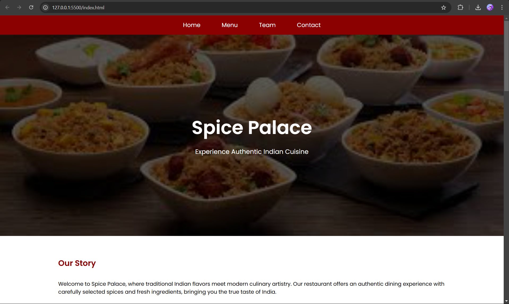
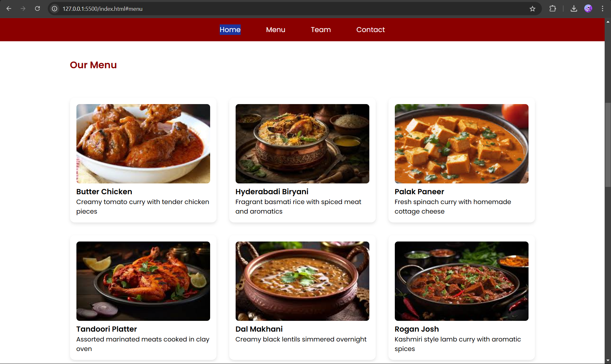
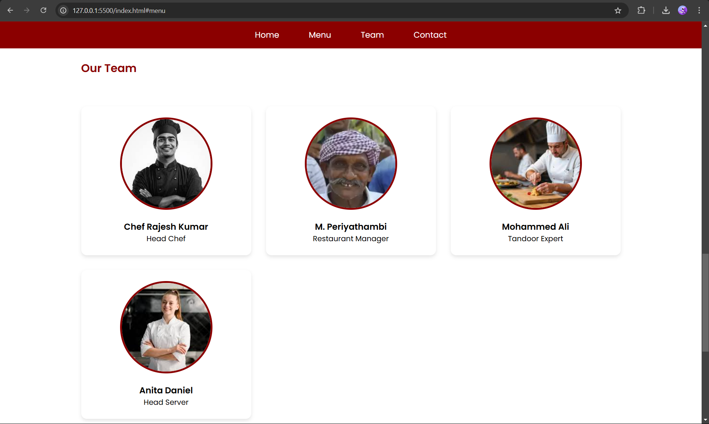
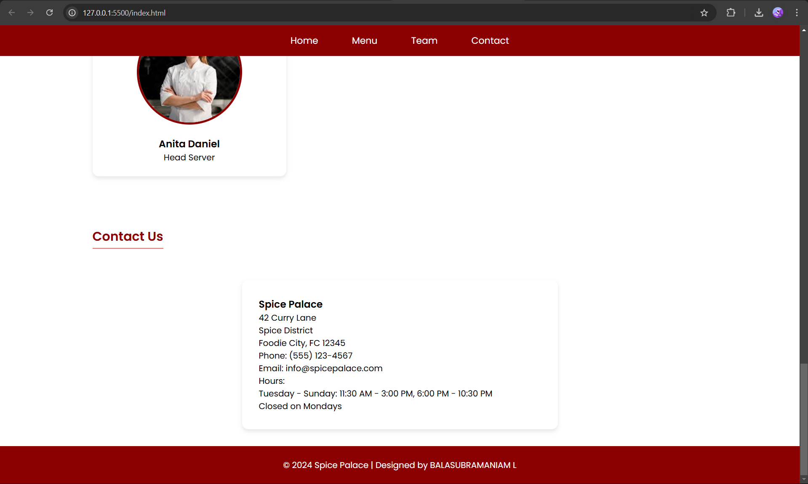

# Ex.07 Restaurant Website
## Date: 21:12:2024
## AIM:
To develop a static Restaurant website to display the food items and services provided by them.

## DESIGN STEPS:
# Step 1:
Requirement collection.

## Step 2:
Creating the layout using HTML and CSS.

## Step 3:
Updating the sample content.

## Step 4:
Choose the appropriate style and color scheme.

## Step 5:
Validate the layout in various browsers.

## Step 6:
Validate the HTML code.

## Step 7:
Publish the website in the given URL.

## PROGRAM:
```
## index.html

<!DOCTYPE html>
<html lang="en">
<head>
    <meta charset="UTF-8">
    <meta name="viewport" content="width=device-width, initial-scale=1.0">
    <title>Spice Palace - Authentic Indian Cuisine</title>
    <link href="https://fonts.googleapis.com/css2?family=Poppins:wght@300;400;500;600&display=swap" rel="stylesheet">
    <link rel="stylesheet" href="styles.css">
</head>
<body>
    <nav>
        <ul>
            <li><a href="#home">Home</a></li>
            <li><a href="#menu">Menu</a></li>
            <li><a href="#administration">Team</a></li>
            <li><a href="#contact">Contact</a></li>
        </ul>
    </nav>

    <!-- Home Page -->
    <section id="home">
        <div class="banner">
            <div>
                <h1>Spice Palace</h1>
                <p>Experience Authentic Indian Cuisine</p>
            </div>
        </div>
        <main>
            <h2 class="section-title">Our Story</h2>
            <p>Welcome to Spice Palace, where traditional Indian flavors meet modern culinary artistry. Our restaurant offers an authentic dining experience with carefully selected spices and fresh ingredients, bringing you the true taste of India.</p>
        </main>
    </section>

    <!-- Menu Page -->
    <section id="menu">
        <main>
            <h2 class="section-title">Our Menu</h2>
            <div class="menu-grid">
                <div class="menu-item">
                    
                    <h3>Butter Chicken</h3>
                    <p>Creamy tomato curry with tender chicken pieces</p>
                </div>
                <div class="menu-item">
                    
                    <h3>Hyderabadi Biryani</h3>
                    <p>Fragrant basmati rice with spiced meat and aromatics</p>
                </div>
                <div class="menu-item">
                    
                    <h3>Palak Paneer</h3>
                    <p>Fresh spinach curry with homemade cottage cheese</p>
                </div>
                <div class="menu-item">
                    
                    <h3>Tandoori Platter</h3>
                    <p>Assorted marinated meats cooked in clay oven</p>
                </div>
                <div class="menu-item">
                    
                    <h3>Dal Makhani</h3>
                    <p>Creamy black lentils simmered overnight</p>
                </div>
                <div class="menu-item">
                    
                    <h3>Rogan Josh</h3>
                    <p>Kashmiri style lamb curry with aromatic spices</p>
                </div>
                <div class="menu-item">
                    
                    <h3>Kerala Fish Curry</h3>
                    <p>Coastal style fish curry with coconut</p>
                </div>
                <div class="menu-item">
                    
                    <h3>Gulab Jamun</h3>
                    <p>Sweet milk dumplings in sugar syrup</p>
                </div>
                <div class="menu-item">
                    
                    <h3>Rasmalai</h3>
                    <p>Soft cheese patties in sweetened milk</p>
                </div>
            </div>
        </main>
    </section>

    <!-- Administration Page -->
    <section id="administration">
        <main>
            <h2 class="section-title">Our Team</h2>
            <div class="team-grid">
                <div class="team-member">
                    
                    <h3>Chef Rajesh Kumar</h3>
                    <p>Head Chef</p>
                </div>
                <div class="team-member">
                    
                    <h3>M. Periyathambi</h3>
                    <p>Restaurant Manager</p>
                </div>
                <div class="team-member">
                    
                    <h3>Mohammed Ali</h3>
                    <p>Tandoor Expert</p>
                </div>
                <div class="team-member">
                    
                    <h3>Anita Daniel</h3>
                    <p>Head Server</p>
                </div>
            </div>
        </main>
    </section>

    <!-- Contact Page -->
    <section id="contact">
        <main>
            <h2 class="section-title">Contact Us</h2>
            <div class="contact-info">
                <h3>Spice Palace</h3>
                <p>42 Curry Lane<br>Spice District<br>Foodie City, FC 12345</p>
                <p>Phone: (555) 123-4567</p>
                <p>Email: info@spicepalace.com</p>
                <p>Hours:<br>
                Tuesday - Sunday: 11:30 AM - 3:00 PM, 6:00 PM - 10:30 PM<br>
                Closed on Mondays</p>
            </div>
        </main>
    </section>

    <footer>
        <p>© 2024 Spice Palace | Designed by BALASUBRAMANIAM L </p>
    </footer>
</body>
</html>
```

```
styles.css
/* Reset and Base Styles */
* {
    margin: 0;
    padding: 0;
    box-sizing: border-box;
    font-family: 'Poppins', sans-serif;
}

:root {
    --primary: #8B0000;
    --secondary: #F5DEB3;
    --accent: #FF6B6B;
    --text: #333333;
    --background: #FAFAFA;
}

/* Navigation */
nav {
    background-color: var(--primary);
    padding: 1rem;
    position: fixed;
    width: 100%;
    top: 0;
    z-index: 100;
}

nav ul {
    list-style: none;
    display: flex;
    justify-content: center;
    gap: 2rem;
}

nav a {
    color: white;
    text-decoration: none;
    font-size: 1.1rem;
    padding: 0.5rem 1rem;
    border-radius: 4px;
    transition: all 0.3s ease;
}

nav a:hover {
    background-color: var(--accent);
    transform: translateY(-2px);
}

/* Banner */
.banner {
    height: 70vh;
    background: linear-gradient(rgba(0,0,0,0.6), rgba(0,0,0,0.6)), url('images/bg.jpeg') center/cover;
    display: flex;
    align-items: center;
    justify-content: center;
    color: white;
    text-align: center;
    margin-top: 3.5rem;
}

.banner h1 {
    font-size: 3.5rem;
    margin-bottom: 1rem;
    animation: fadeIn 1.5s ease-out;
}

.banner p {
    font-size: 1.2rem;
    animation: slideUp 1.5s ease-out;
}

/* Main Content */
main {
    max-width: 1200px;
    margin: 2rem auto;
    padding: 0 1rem;
}

/* Menu Page */
.menu-grid {
    display: grid;
    grid-template-columns: repeat(auto-fit, minmax(300px, 1fr));
    gap: 2rem;
    padding: 2rem 0;
}

.menu-item {
    background: white;
    padding: 1rem;
    border-radius: 12px;
    box-shadow: 0 4px 8px rgba(0,0,0,0.1);
    transition: transform 0.3s ease, box-shadow 0.3s ease;
    overflow: hidden;
}

.menu-item:hover {
    transform: translateY(-10px);
    box-shadow: 0 8px 16px rgba(0,0,0,0.2);
}

.menu-item img {
    width: 100%;
    height: 200px;
    object-fit: cover;
    border-radius: 8px;
    transition: transform 0.3s ease;
}

.menu-item:hover img {
    transform: scale(1.05);
}

/* Administration Page */
.team-grid {
    display: grid;
    grid-template-columns: repeat(auto-fit, minmax(300px, 1fr));
    gap: 2rem;
    padding: 2rem 0;
}

.team-member {
    text-align: center;
    background: white;
    padding: 1.5rem;
    border-radius: 12px;
    box-shadow: 0 4px 8px rgba(0,0,0,0.1);
    transition: transform 0.3s ease;
}

.team-member:hover {
    transform: translateY(-5px);
}

.team-member img {
    width: 200px;
    height: 200px;
    border-radius: 50%;
    object-fit: cover;
    margin-bottom: 1rem;
    border: 4px solid var(--primary);
    transition: transform 0.3s ease;
}

.team-member:hover img {
    transform: scale(1.1);
}

/* Contact Page */
.contact-info {
    background: white;
    padding: 2rem;
    border-radius: 12px;
    box-shadow: 0 4px 8px rgba(0,0,0,0.1);
    max-width: 600px;
    margin: 2rem auto;
    transition: transform 0.3s ease;
}

.contact-info:hover {
    transform: translateY(-5px);
}

/* Footer */
footer {
    background: var(--primary);
    color: white;
    text-align: center;
    padding: 1.5rem;
    margin-top: 2rem;
}

/* Common Styles */
h2 {
    color: var(--primary);
    margin-bottom: 1.5rem;
    position: relative;
    display: inline-block;
}

h2::after {
    content: '';
    position: absolute;
    bottom: -5px;
    left: 0;
    width: 100%;
    height: 2px;
    background: var(--accent);
    transform: scaleX(0);
    transition: transform 0.3s ease;
}

h2:hover::after {
    transform: scaleX(1);
}

.section-title {
    text-align: center;
    margin: 2rem 0;
}

/* Animations */
@keyframes fadeIn {
    from { opacity: 0; }
    to { opacity: 1; }
}

@keyframes slideUp {
    from {
        opacity: 0;
        transform: translateY(20px);
    }
    to {
        opacity: 1;
        transform: translateY(0);
    }
}

/* Responsive Design */
@media (max-width: 768px) {
    nav ul {
        flex-direction: column;
        text-align: center;
    }
    
    .banner h1 {
        font-size: 2.5rem;
    }
    
    .menu-grid {
        grid-template-columns: 1fr;
    }
    
    .team-grid {
        grid-template-columns: 1fr;
    }
}

```
## OUTPUT:





## RESULT:
The program for designing software company website using HTML and CSS is completed successfully.
